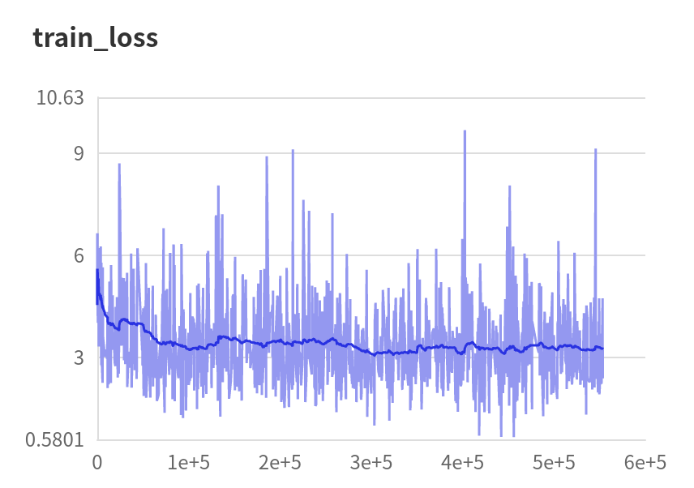

# Paddle-CIC

English| [简体中文](./README_cn.md)

* [Paddle-CIC]()
  * [1. Introduction](#1-Introduction)
  * [2. Acdcuracy](#2-Accuracy)
  * [3. Dataset](#3-Dataset)
  * [4. Dependency](#4-Dependency)
  * [5. Quick Start](#5-Quick-Start)
    * [step1:Colne](#51-step1Clone)
    * [step2:Training](#52-step2Training)
    * [step3:Testing](#53-step3Testing)
    * [Prediction with pre-trained model](#54-Prediction with pre-trained model)
  * [6. Code Structure and Description](#6-Code Structure and Description)
    * [6.1 code structure](#61-code structure)
    * [6.2 description](#62-description)
  * [7. Results](#7-Results)
  * [8. Model Information](#8-Model-Information)

## 1. Introduction

This project is based on the PaddlePaddle framework to reproduce the classical image colorization paper CIC (Colorful Image Colorization), CIC is able to model the color channels for grayscale input and recover the color of the image. The innovation of this paper is to consider the prediction of color channels (ab) as a classification task, i.e., the real ab channels are first encoded into 313 bins, and the forward process of the model is equivalent to performing 313 class classification. At the same time, in order to solve the problem that the image recovered color is affected by a large unsaturated area such as the background, the loss of each pixel is weighted according to the prior distribution of ab, which is essentially equivalent to doing color class balancing.

**Paper**

* [1] Zhang R ,  Isola P ,  Efros A A . Colorful Image Colorization[C]// European Conference on Computer Vision. Springer International Publishing, 2016.

**Projects**

* [Official Caffe Implement](https://github.com/richzhang/colorization/tree/caffe)
* [Unofficial Pytorch implement](https://github.com/Epiphqny/Colorization)

**Online Operation**

* Ai Studio job project：[https://aistudio.baidu.com/aistudio/clusterprojectdetail/2304371](https://aistudio.baidu.com/aistudio/clusterprojectdetail/2304371)


## 2. Accuracy

| Model                                    | AuC    | ACC    |
| ---------------------------------------- | ------ | ------ |
| Full (color rebalance, $\lambda=0.5$ )   | 87.48% | 58.19% |
| Non-rebalance                            | 90.89% | 60.54% |
| Rebalance(color rebalance, $\lambda=0$ ) | 87.07% | 57.65% |

* **Note**: The original paper used 10,000 independent sheets from the mageNet validation set as a test set when evaluating model performance, and since it was not possible to determine which part, the metrics for this replication were obtained on the entire validation and the validation set was not used for the entire training process.

  

## 3. Dataset

The original paper used 10,000 independent sheets from the mageNet validation set as a test set when evaluating the model performance. Since it was not possible to determine which part, the metrics for this replication were obtained on the entire validation and the validation set was not used throughout the training process.


## 4. Dependency

* Hardware：GPU、CPU
* Pacakge： scikit-image>=0.14.2
* Framework：PaddlePaddle>=2.0.0


## 5. Quick Start

### Clone

```python
git clone https://github.com/Callifrey/Paddle-CIC.git
cd Paddle-CIC
```

### Training

Due to the RAM limitations of the Ai Studio scripting task, this implementation uses four Tesla V100 GPUs in parallel, with training initiated as follows.

```python
python -m paddle.distributed.launch --gpus '0,1,2,3' train.py --image_dir [training path]
```

### Testing

* **step1：** Since there are single channel grayscale images in ImageNet's validation set, these images are invalid for testing, first run the following code to find the invalid images

  ```python
  python get_invalid_images.py
  ```

  The above code will generate a delete script in the root directory after execution, execute the script file to delete invalid images

  ```python
  bash remove_invalid.sh
  ```

* **step2：**generate colorization results

  ```python
  python test.py --image_dir [testing path]
  ```

* **step3：** Image classification is performed on the generated colorized images to get the classification accuracy, because the generated colorized images can get higher classification accuracy than grayscale images when the colorized model performs well. Here, consistent with the original paper, a pre-trained VGG-16 is used to perform the classification. The model structure and pre-trained weights are obtained from paddle.vision.models.

  ```python
  python metrics_acc.py 
  ```

  The final precision results are written to the specified directory(eg:[./metric/metric_results](./metric/metric_results))

* **step4：** The Euclidean distance is calculated between the real image and the ab channel of the generated image, and the proportion of pixels within a specific threshold is counted. The thresholds are scanned one by one from 0 to 150, and the final statistics are drawn as a curve to calculate the area under the curve. This is similar to the traditional AuC calculation, but this implementation does not use a third-party library, and directly approximates the area under the curve by the area of the **"right-angle trapezoid "** formed between two adjacent thresholds. Summing over 150 trapezoid areas and then normalizing.

  ```pytho
  python metrics_auc.py
  ```

  The final precision results are written to the specified directory
  
  

### Prediction with pre-trained mode

The pre-training model for this implementation is available at [Baidu Cloud Drive](https://pan.baidu.com/s/1znPsSVKCUeNYLev5Aicq4w ), extraction code: [hhg4 ](#), The pre-training model consists of three groups, which are Full model, Non-rebalance variant, and Rebalance variants. Each folder contains the final checkpoint and the train loss recorded during training using the Paddle visualdl tool.

## 6. Code structure and description

### 6.1 code structure

```python
├─imgs                            # dir for all imags
├─log                             # dir for log files
├─metric                          # dir for metric files
├─resources                       # code and data from others
├─model                           # dir for checkpoints
├─result                          # dir for results saved
│  README.md                      # Englisg readme
│  README_cn.md                   # Chiniese readme
│  dataset.py                     # Class for dataset
│  get_invalid_images             # finding invalid images
│  remove_invalid.sh              # delete invalid images
│  metrics_acc.py                 # testing for image classification
│  metrics_auc.py                 # testing for AuC
│  model.py                       # model structure
│  train.py                       # training code
│  test.py                        # testing code
│  utils.py                       # tool classes
```

### 6.2 参数说明

* **train.py** description for parameters(partly)

  | Parameters           | Default                                            | Description                              |
  | -------------------- | -------------------------------------------------- | ---------------------------------------- |
  | **--image_dir**      | str: ‘/media/gallifrey/DJW/Dataset/Imagenet/train’ | Path for training data                   |
  | **--continue_train** | bool: False                                        | wheather to continue training            |
  | **--which_epoch**    | str: 'latest'                                      | start checkpoint                         |
  | **--num_epoch**      | int: 20                                            | number of epoches                        |
  | **--lr**             | float: 3.16e-5                                     | initial learning rate                    |
  | **--rebalance**      | bool: True                                         | color rebalance or not                   |
  | **--NN**             | int: 5                                             | number of neighor for KNN                |
  | **--sigma**          | float: 5.0                                         | kernal size for gussian                  |
  | **--gamma**          | float: 0.5                                         | coefficient for mixture of distributions |

* **test.py** description for parameters(partly)

  | Parameters        | Default                                           | Description            |
  | ----------------- | ------------------------------------------------- | ---------------------- |
  | **--model_path**  | str： './model'                                   | path for models        |
  | **--image_dir**   | str： ‘/media/gallifrey/DJW/Dataset/Imagenet/val' | path for testing data  |
  | **--load_model**  | str: '19'                                         | checkpoint ID          |
  | **--result_path** | str: './result'                                   | result path            |
  | **--max_samples** | int: int(sys.maxsize)                             | max number to generate |


## 7. Results

### 7.1 Training loss and AuC curve

|                    Full model                    |                  variant：non-rebalance                   |                 bariant2：rebalance                 |
| :----------------------------------------------: | :-------------------------------------------------------: | :-------------------------------------------------: |
|               |                  |                    |
|  |  |  |

### 7.2 Sample results

20 images are randomly selected from the coloring images generated in the final model, and the coloring effect is shown in the following figure:


To compare the coloring effect and to illustrate the effectiveness of color rebalance, several sets of grayscale images (Gray), no color rebalance (Non-rebalance), added color rebalance (Rebalance), and real images (Ground Truth) are shown here.


## 8. Model Information

Additional information about the model can be found in the following table:

| Information           | Description                                                  |
| --------------------- | ------------------------------------------------------------ |
| Author                | Dai Jiawu                                                    |
| Date                  | 2021.09                                                      |
| Framework version     | Paddle 2.0.2                                                 |
| Application scenarios | Image Colorization                                           |
| Supported Hardware    | GPU、CPU                                                     |
| Download link         | [Pre-trained model](https://pan.baidu.com/s/1znPsSVKCUeNYLev5Aicq4w ) (code：hhg4) |
| Online operation      | [Scripts](https://aistudio.baidu.com/aistudio/clusterprojectdetail/2304371) |

