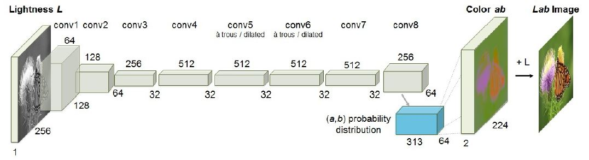
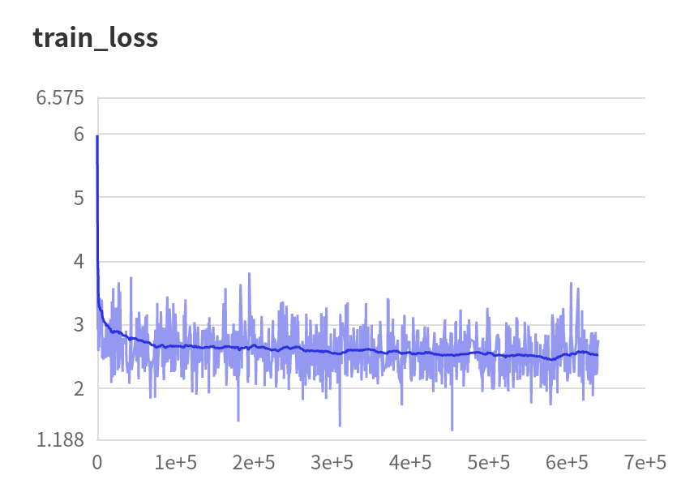
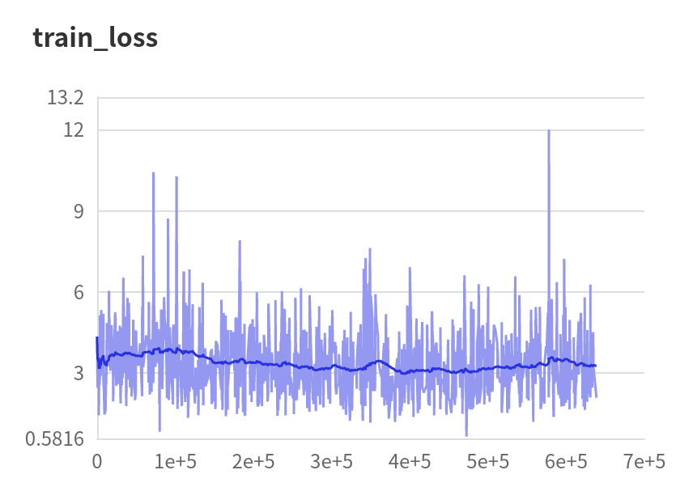
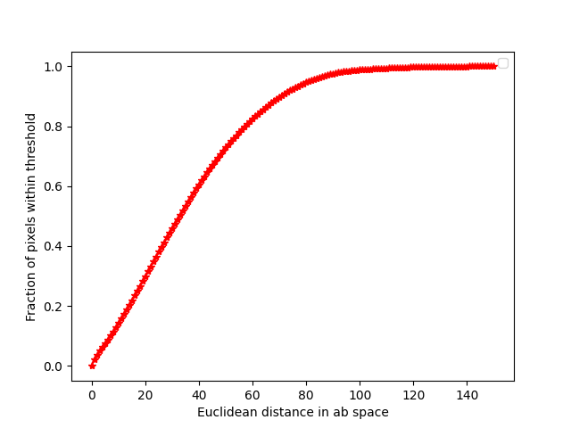

# Paddle-CIC

[English](./README.md) | 简体中文

* [Paddle-CIC]()
  * [一、简介](#一简介)
  * [二、复现精度](#二复现精度)
  * [三、数据集](#三数据集)
  * [四、环境依赖](#环境依赖)
  * [五、快速开始](#五快速开始)
    * [step1:克隆](#克隆)
    * [step2:训练](#训练)
    * [step3:测试](#测试)
    * [使用预训练模型预测](#使用预训练模型预测)
  * [六、代码结构与详细说明](#六代码结构与详细说明)
    * [6.1 代码结构](#61-代码结构)
    * [6.2 参数说明](#62-参数说明)
  * [七、结果展示](#七结果展示)
  * [八、模型信息](#八模型信息)

## 一、简介



本项目是基于PaddlePaddle框架复现经典图像上色论文CIC(Colorful Image Colorization), CIC能够对灰度输入进行彩色通道的建模，对图像的色彩进行复原。该论文的创新点在于将色彩通道（ab）的预测视为一个分类任务，即首先将真实的ab通道编码成313个bin, 模型的前向过程相当于在进行313类分类。同时为了解决图像复原色彩受到背景等大范围非饱和区域的影响，根据ab的先验分布对各个pixel的损失进行加权，实质上等同于做了颜色类别平衡。

**论文**

* [1] Zhang R ,  Isola P ,  Efros A A . Colorful Image Colorization[C]// European Conference on Computer Vision. Springer International Publishing, 2016.

**参考项目**

* [官方Caffe实现](https://github.com/richzhang/colorization/tree/caffe)
* [非官方Pytorch实现](https://github.com/Epiphqny/Colorization)

**在线运行**

* Ai Studio 脚本项目：[https://aistudio.baidu.com/aistudio/clusterprojectdetail/2304371](https://aistudio.baidu.com/aistudio/clusterprojectdetail/2304371)


## 二、复现精度

CIC模型是在224x224分辨率上进行训练的，但由于模型中只包含卷积层，因此在做测试时可以处理任意尺寸的图像输入，由此我们报告两组不同的测试结果：

* 按原始尺寸输入

  | 模型                                             | AuC        | ACC                         |
  | ------------------------------------------------ | ---------- | --------------------------- |
  | Full 模型(使用color rebalance, $\lambda=0.5$ )   | 86.36%     | **56.0%**  (两位小数55.89%) |
  | Non-rebalance变体                                | **90.61%** | 59.32%                      |
  | Rebalance变体(使用color rebalance, $\lambda=0$ ) | **75.82%** | 41.37%                      |

* 将测试集图像调整成224x224

  | 模型                                             | AuC        | ACC        |
  | ------------------------------------------------ | ---------- | ---------- |
  | Full 模型(使用color rebalance, $\lambda=0.5$ )   | 87.36%     | **56.44%** |
  | Non-rebalance变体                                | **91.13%** | 59.40%     |
  | Rebalance变体(使用color rebalance, $\lambda=0$ ) | **77.91%** | 42.86%     |

* **注意：**加粗的指标是论文中报告的指标，在两种测试设置下均对齐。

## 三、数据集

论文中的数据集是[ImageNet](https://image-net.org/), 实验是在CIE Lab颜色空间上进行的，原始的ImageNet数据集包括约130W张训练图像， 50000张验证集图像和10000张测试图像，本次复现训练集使用原始训练集。根据论文说明，模型的验证是在前10000张验证集上进行的，测试则是在验证集中独立的10000张图像上进行的。该划分遵循论文["Learning representations for automatic colorization "](https://link.springer.com/chapter/10.1007/978-3-319-46493-0_35) , 具体的划分策略见[论文官网](http://people.cs.uchicago.edu/~larsson/colorization/). 请把对应的图像放在 [./data/xxx](./data)目录下。


## 四、环境依赖

* 硬件：GPU、CPU
* 依赖包： scikit-image>=0.14.2
* 框架：PaddlePaddle>=2.0.0


## 五、快速开始

### 克隆

```python
git clone https://github.com/Callifrey/Paddle-CIC.git
cd Paddle-CIC
```

### 训练

由于Ai Studio脚本任务的RAM限制，本实现使用了四块Tesla V100 GPU并行，训练启动如下：

```python
python -m paddle.distributed.launch --gpus '0,1,2,3' train.py --image_dir [training path]
```

### 测试

* **步骤1：** 生成上色图像

  ```python
  python test.py --image_dir [testing path]
  ```

* **步骤2：** 对生成的上色图像执行图像分类，得到分类精度，因为当上色模型表现良好时生成的上色图像可以得到比灰度图像更高的分类精度。这里和原文一致，使用预训练好的VGG-16执行分类。模型结构和预训练权重均来自于paddle.vision.models：

  ```python
  python metrics_acc.py 
  ```

  最终的精度结果会写入指定的目录中(例:[./metric/metric_results_224/full](./metric/metric_results_224/full))

* **步骤3：** 在真实图像与生成图像的ab通道之间计算欧式距离，并统计在特定阈值内的像素比例，阈值从0到150逐个扫描，将最后的统计结果画出曲线，计算曲线下方的面积。这里与传统的AuC计算类似，但本实现未使用第三方库，直接以相邻两个阈值间构成的**“直角梯形”** 的面积近似为曲线下方面积。对150个梯形面积进行求和后再归一化：

  ```python
  python metrics_auc.py
  ```

  运行后AuC指标及绘制的曲线都保存在指定目录中

### 使用预训练模型测试

本实现的预训练模型见[百度云盘]( https://pan.baidu.com/s/16irXOKfOC1T_wKV_TC73Jw ), 提取码：[f444 ](#), 预训练模型包括三组，分别是Full model、Non-rebalance变体以及Rebalance 变体。各文件夹内包含最终的checkpoint和训练期间使用Paddle visualdl工具记录的train loss。


## 六、代码结构与详细说明

### 6.1 代码结构

```python
├─imgs                            # 各类图像
├─log                             # 日志保存
├─metric                          # 指标保存
├─resources                       # 借用的部分代码及数据
├─model                           # 模型保存
├─result                          # 结果保存
│  README.md                      # 英文readme
│  README_cn.md                   # 中文readme
│  dataset.py                     # 数据集类
│  get_invalid_images             # 找出val中无效图像
│  remove_invalid.sh              # 删除val中无效图像
│  metrics_acc.py                 # 图像分类测试
│  metrics_auc.py                 # AuC测试
│  model.py                       # 模型结构
│  train.py                       # 训练
│  test.py                        # 测试
│  utils.py                       # 部分工具类
```

### 6.2 参数说明

* **train.py** 参数说明(部分)

  | 参数                 | 默认值                                             | 说明                         |
  | -------------------- | -------------------------------------------------- | ---------------------------- |
  | **--image_dir**      | str: ‘/media/gallifrey/DJW/Dataset/Imagenet/train’ | 训练集路径                   |
  | **--continue_train** | bool: False                                        | 是否从断点继续训练           |
  | **--which_epoch**    | str: 'latest'                                      | 开始训练的断点               |
  | **--num_epoch**      | int: 20                                            | 训练epoch数                  |
  | **--lr**             | float: 3.16e-5                                     | 初始学习率                   |
  | **--rebalance**      | bool: True                                         | 是否使用color rebalance策略  |
  | **--NN**             | int: 5                                             | 最近邻搜索时的邻居个数       |
  | **--sigma**          | float: 5.0                                         | 高斯核参数                   |
  | **--gamma**          | float: 0.5                                         | 先验分布与均匀分布的混合系数 |

* **test.py** 参数说明(部分)

  | 参数              | 默认值                                            | 说明               |
  | ----------------- | ------------------------------------------------- | ------------------ |
  | **--model_path**  | str： './model'                                   | 加载模型路径       |
  | **--image_dir**   | str： ‘/media/gallifrey/DJW/Dataset/Imagenet/val' | 测试数据集路径     |
  | **--load_model**  | str: '19'                                         | 加载模型ID         |
  | **--result_path** | str: './result'                                   | 保存生成图像的路径 |
  | **--max_samples** | int: int(sys.maxsize)                             | 最大的生成样本数   |


## 七、结果展示

### 7.1 训练Loss及绘制的AuC曲线

|                         最终模型                          |                     变体1：non-rebalance                     |                       变体2：rebalance                       |
| :-------------------------------------------------------: | :----------------------------------------------------------: | :----------------------------------------------------------: |
|                        |                     |                             |
|  |  |  |

### 7.2 生成的上色图像示例

从最终模型中生成的上色图像中随机挑选20张图像，上色效果如下图所示。


最后，为了对比上色效果及说明color rebalance的有效性，此处展示了多组灰度图像(Gray)、不做色彩再平衡(Non-rebalance)、加入色彩再平衡（Rebalance）以及真实图像（Ground Truth）：


## 八、模型信息

关于模型的其他信息，可以参考下表：

| 信息     | 说明                                                         |
| -------- | ------------------------------------------------------------ |
| 发布者   | 戴家武                                                       |
| 时间     | 2021.09                                                      |
| 框架版本 | Paddle 2.0.2                                                 |
| 应用场景 | 图像上色                                                     |
| 支持硬件 | GPU、CPU                                                     |
| 下载链接 | [预训练模型](https://pan.baidu.com/s/16irXOKfOC1T_wKV_TC73Jw  ) (提取码：f444) |
| 在线运行 | [脚本任务](https://aistudio.baidu.com/aistudio/clusterprojectdetail/2304371) |

